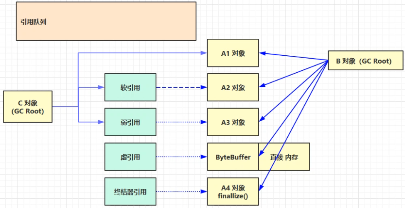
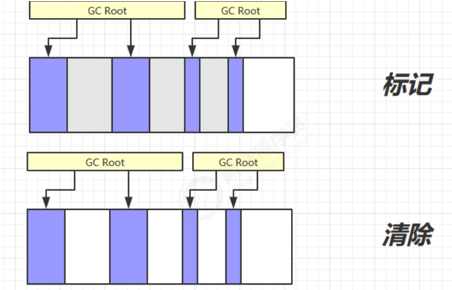
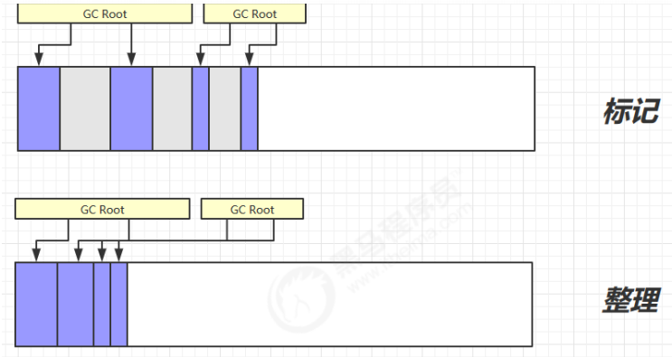
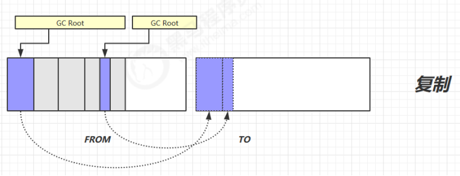
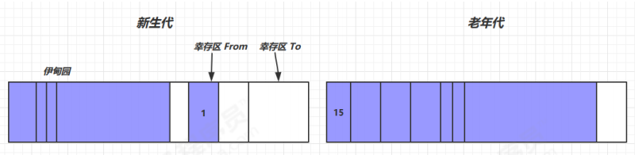
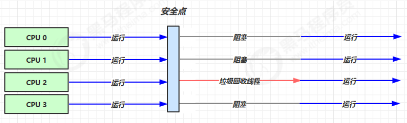
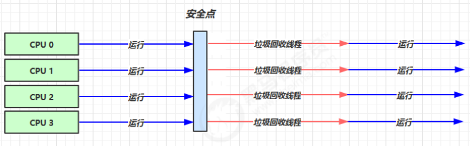
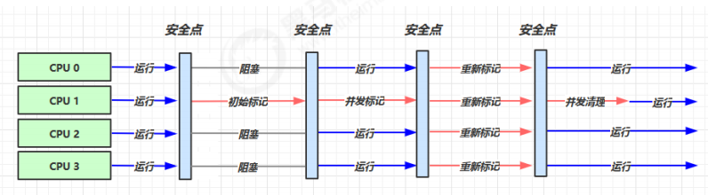
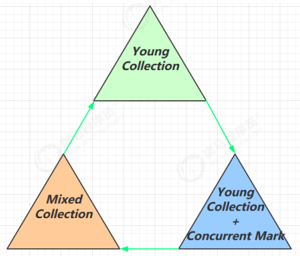

# JVM——垃圾回收

1. 如何判断对象可以回收
2. 垃圾回收算法
3. 分代垃圾回收
4. 垃圾回收器
5. 垃圾回收调优

## 1. 如何判断对象可以回收

### 1.1 引用计数法

1. 根据对象被其他对象的引用数判断
2. 如果两个对象互相引用，会产生内存泄露

### 1.2 可达性分析

1. 确定一系列对象作为根对象，一般是肯定不能被当成垃圾的对象
2. Java 虚拟机中的垃圾回收器采用可达性分析来探索所有存活的对象
3. 扫描堆中的对象，看是否能够沿着`GC Root`对象 为起点的引用链找到该对象，找不到，表示可以回收

### 1.3 四种引用



1. 强引用

   - 有 GC Roots 对象都不通过【强引用】引用该对象，该对象才能被垃圾回收

2. 软引用（SoftReference）

   - 仅有软引用引用该对象时，在垃圾回收后，内存仍不足时会再次出发垃圾回收，回收软引用对象

   - 可以配合引用队列来释放软引用自身

   ```java
   /**
    * 演示软引用
    * -Xmx20m -XX:+PrintGCDetails -verbose:gc
    */
   public class Demo2_3 {
   
       private static final int _4MB = 4 * 1024 * 1024;
   
   
   
       public static void main(String[] args) throws IOException {
           /*List<byte[]> list = new ArrayList<>();
           for (int i = 0; i < 5; i++) {
               list.add(new byte[_4MB]);
           }
   
           System.in.read();*/
           soft();
   
   
       }
   
       public static void soft() {
           // list --> SoftReference --> byte[]
   
           List<SoftReference<byte[]>> list = new ArrayList<>();
           for (int i = 0; i < 5; i++) {
               SoftReference<byte[]> ref = new SoftReference<>(new byte[_4MB]);
               System.out.println(ref.get());
               list.add(ref);
               System.out.println(list.size());
   
           }
           System.out.println("循环结束：" + list.size());
           for (SoftReference<byte[]> ref : list) {
               System.out.println(ref.get());
           }
       }
   }
   ```

3. 弱引用（WeakReference）

   - 仅有弱引用引用该对象时，在垃圾回收时，无论内存是否充足，都会回收弱引用对象

   - 可以配合引用队列来释放弱引用自身

   ```java
   /**
    * 演示弱引用
    * -Xmx20m -XX:+PrintGCDetails -verbose:gc
    */
   public class Demo2_5 {
       private static final int _4MB = 4 * 1024 * 1024;
   
       public static void main(String[] args) {
           //  list --> WeakReference --> byte[]
           List<WeakReference<byte[]>> list = new ArrayList<>();
           for (int i = 0; i < 10; i++) {
               WeakReference<byte[]> ref = new WeakReference<>(new byte[_4MB]);
               list.add(ref);
               for (WeakReference<byte[]> w : list) {
                   System.out.print(w.get()+" ");
               }
               System.out.println();
   
           }
           System.out.println("循环结束：" + list.size());
       }
   }
   ```

4. 虚引用（PhantomReference）

   - 必须配合引用队列使用，主要配合 ByteBuffffer 使用，被引用对象回收时，会将虚引用入队，由 Reference Handler 线程调用虚引用相关方法释放直接内存

5. 终结器引用（FinalReference）
   
   - 无需手动编码，但其内部配合引用队列使用，在垃圾回收时，终结器引用入队（被引用对象暂时没有被回收），再由 Finalizer 线程通过终结器引用找到被引用对象并调用它的 fifinalize方法，第二次 GC 时才能回收被引用对象

## 2. 垃圾回收算法

### 2.1 标记清除 Mark Sweep



- 速度较快
- 内存碎片化，有大对象时可能无法插入

### 2.2 标记整理 Mark Compact



- 速度慢
- 不会有内存碎片

### 2.3 复制 Copy



- 速度快
- 不会有内存碎片
- 需要占用双倍内存空间

## 3. 分代垃圾回收



### 3.1 定义特性

- 对象首先分配在伊甸园区域

- 新生代空间不足时，触发 minor gc，伊甸园和 from 存活的对象使用 copy 复制到 to 中，存活的对象年龄加 1并且交换 from to

- minor gc 会引发 stop the world，暂停其它用户的线程，等垃圾回收结束，用户线程才恢复运行

- 当对象寿命超过阈值时，会晋升至老年代，最大寿命是15（4bit）

- 当老年代空间不足，会先尝试触发 minor gc，如果之后空间仍不足，那么触发 full gc，STW的时间更长

### 3.2 相关参数

| 参数说明           | 参数                                                         |
| :----------------- | ------------------------------------------------------------ |
| 堆初始大小         | -Xms                                                         |
| 堆最大大小         | -Xmx 或 -XX:MaxHeapSize=size                                 |
| 新生代大小         | -Xmn 或 (-XX:NewSize=size + -XX:MaxNewSize=size )            |
| 幸存区比例（动态） | -XX:InitialSurvivorRatio=ratio 和 -XX:+UseAdaptiveSizePolicy |
| 幸存区比例         | -XX:SurvivorRatio=ratio                                      |
| 晋升阈值           | -XX:MaxTenuringThreshold=threshold                           |
| 晋升详情           | -XX:+PrintTenuringDistribution                               |
| GC详情             | -XX:+PrintGCDetails -verbose:gc                              |
| FullGC 前 MinorGC  | -XX:+ScavengeBeforeFullGC                                    |

## 4. 垃圾回收器

### 4.1 串行



- 单线程

- 堆内存较小，适合个人电脑

- 参数：`-XX:+UseSerialGC = Serial + SerialOld`

### 4.2 吞吐量优先



- 让单位时间内，STW 的时间最短（0.2 + 0.2 = 0.4），垃圾回收时间占比最低，这样就称吞吐量高

- 参数

  ```shell
  -XX:+UseParallelGC ~ -XX:+UseParallelOldGC
  -XX:GCTimeRatio=ratio 
  -XX:MaxGCPauseMillis=ms 
  -XX:ParallelGCThreads=n
  ```

### 4.3 响应时间优先



- 多线程
- 堆内存较大，多核 cpu
- 尽可能让单次 STW 的时间最短 （0.1 + 0.1 + 0.1 + 0.1 + 0.1 = 0.5）

- 参数

  ```shell
  -XX:+UseConcMarkSweepGC ~ -XX:+UseParNewGC ~ SerialOld
  -XX:ParallelGCThreads=n ~ -XX:ConcGCThreads=threads 
  -XX:CMSInitiatingOccupancyFraction=percent 
  -XX:+CMSScavengeBeforeRemark
  ```

### 4.4 G1 Garbage First



- 同时注重吞吐量（Throughput）和低延迟（Low latency），默认的暂停目标是 200 ms
- 超大堆内存，会将堆划分为多个大小相等的`Region`
- 整体上是`标记+整理`算法，两个区域之间是`复制`算法

- 参数

  ```shell
  -XX:+UseG1GC 
  -XX:G1HeapRegionSize=size 
  -XX:MaxGCPauseMillis=time
  ```

  