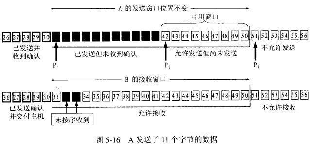
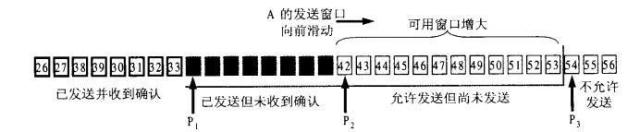

## 概念

操作系统通过TCP协议将数据包是顺序地一批一批的发送给对方，就像一个窗口，不停地往后移动，我们称之为TCP滑动窗口协议。

## 作用意义

- 首先当然是可靠性，滑动窗口只有在队列前部的被确认之后，才会往后移动，保证数据包被接收方确认并接收。

- 其次是传输效率，假如没有窗口，服务端是杂乱无章地进行发包，因为TCP的队首效应，如果有前面的包没有发送成功，就会不停的重试，反而造成更差的传输效率。

- 最后是稳定性，TCP的滑动窗口大小，是整个复杂网络商榷的结果，会进行动态调整，可以尽量地避免网络拥塞，更加稳定。

## 实现逻辑

在TCP中，窗口的大小是在TCP三次握手后协定的，并且窗口的大小并不是固定的，而是会随着网络的情况进行调整。

通过一个图来解释下滑动窗口的工作流程，对于发送端来说，即将要发送的数据包排成一个队列，对于发送者来说，数据包总共分成四类。分别是在窗口前的，已经发送给接收方，并且收到了接收方的答复，我们称之为已发送。在窗口中的，有两种状态，一个是已经发送给接收方，但是接收方还没确认送达，我们称之为已发送未确认，另外一个是可以发送了，但是还没有发送，我们称之为允许发送未发送。最后的是在窗口外面的，我们称之为不可发送，除非窗口滑到此处，否则不会进行发送。

一旦前面的数据已经得到服务端确认了，这个窗口就会慢慢地往后滑，如下图所示，P1,P2两个数据包被确认之后，窗口就往后移动，后面新的数据包就由不可发送待发送变成了可发送状态了。

> 参考文章 [程序员快餐，五分钟了解下面试常问的TCP滑动窗口机制](https://baijiahao.baidu.com/s?id=1650553452294041970&wfr=spider&for=pc)